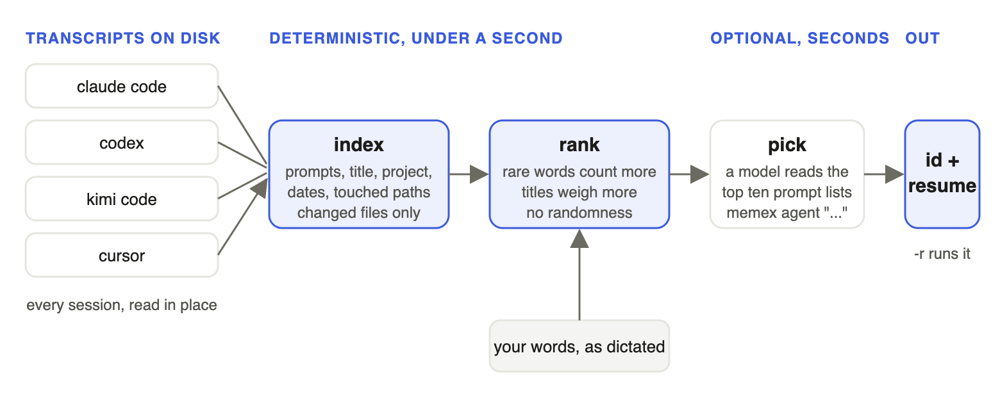

# memex

Describe a past coding-agent session from memory and get back its id and the command that reopens it. Works across Claude Code, Codex, Kimi Code and Cursor.

```
memex "the one where I made my claude skills and hooks work in codex, then kimi, then cursor"
```

```
 1. 188.26  claude 2026-09-10  tools   a122183c-3aed-48c9-a384-c57502e60429
      Open source LLM subscriptions comparison
      > So, I want to try out a new LLM subscription using the open source models...
      terms: agent claude codex cursor harness hook kimi skill   turns: 13
 2. ...

resume: cd /Users/you/tools && claude --resume a122183c-3aed-48c9-a384-c57502e60429
```

## How it works

<picture>
  <source media="(prefers-color-scheme: dark)" srcset="docs/how-it-works-dark.png">
  
</picture>

Everything left of the model call is deterministic and runs in well under a second. The model call is optional and is the only step that takes seconds.

1. **index.** Every transcript on disk is read once into one record per session: its user prompts, title, project, branch, dates and the file paths the agent touched. Injected system text, tool results and hook output are stripped. Later runs reparse only files whose size or mtime changed.
2. **rank.** Your words are matched against every record. Rare words count more than common ones, a hit in the title or project name counts more than a hit in a late prompt, plurals and -ed/-ing are folded, and recent sessions get a small boost. Same words, same index, same answer every time.
3. **pick, only with `memex agent`.** The top ten records go to a model along with each one's prompt list, in one call. The model reads what you actually asked for in each session and returns one number. It sees the prompts, not the titles, because a title comes from the first prompt and often names only how a session started.
4. **resume.** The output is the harness, date, project, id and the exact command that reopens the session. `-r` runs that command for you.

## Usage

```
memex "<what you remember>"           rank only, no model call
memex agent "<what you remember>"     rank, then one model call picks. claude sonnet by default
memex agent -a codex -m gpt-5 "..."   another agent and model do the picking
memex -r "..."                        run the resume command of the pick or first hit

memex show <id>                       one session in full: prompts, paths, transcript file, resume command
memex resume <id>                     print the resume command
memex grep <regex>                    scan the raw transcripts, including assistant output
memex index                           refresh the index
memex stats                           sessions per harness, index location
```

Every option has a short and a long form. `memex -h` prints the full help.

| option | what it does |
|---|---|
| `-r`, `--resume` | run the resume command instead of printing it |
| `-a`, `--agent` | who picks in agent mode: `claude`, `codex`, `kimi`, `cursor`, `local` (ollama) |
| `-m`, `--model` | model for that agent, passed through as is |
| `-n`, `--limit` | how many hits to print, or how many candidates the model sees |
| `-f`, `--from` | only sessions from one harness |
| `-p`, `--project` | only sessions whose project directory or path contains this |
| `-s`, `--since`, `-u`, `--until` | date window, `YYYY-MM-DD`. Phrases like "last week" or "a few weeks ago" set one on their own |
| `-x`, `--exclude` | drop a session id prefix. An agent should pass its own session id |
| `-j`, `--json` | machine output |
| `-A`, `--all` | include background sessions and sessions with no user prompt |

## Install

Needs a Rust toolchain. No runtime dependencies.

```
git clone https://github.com/otech47/memex
cd memex
cargo build --release
ln -s "$PWD/target/release/memex" ~/.local/bin/memex
```

The index lives at `~/.agents/memex/index.jsonl`. `MEMEX_INDEX_DIR` moves it, `MEMEX_AGENT` and `MEMEX_MODEL` set the defaults for agent mode.

## For agents

`AGENTS.md` in this repo tells a coding agent how to install memex and how to use it. `skills/memex/SKILL.md` is the same guidance as a skill. Point your agent at the repo, or drop the skill into your skills directory.

<details>
<summary>what gets read, per harness</summary>

| harness | transcript | resume |
|---|---|---|
| Claude Code | `~/.claude/projects/<slug>/<id>.jsonl`, subagent `agent-*.jsonl` files skipped | `claude --resume <id>` |
| Codex | `~/.codex/sessions/Y/M/D/rollout-*.jsonl`, only threads a user started, names from `session_index.jsonl` | `codex resume <id>` |
| Kimi Code | `~/.kimi-code/sessions/wd_*/session_*/agents/main/wire.jsonl` plus `state.json` | `kimi --session <id>` |
| Cursor | `~/.cursor/chats/<workspace>/<id>/meta.json` and `prompt_history.json`, tool paths from `~/.cursor/sessions/<id>.jsonl` | `agent --resume <id>` |

Transcripts are read in place and never modified.

</details>

<details>
<summary>the ranking, exactly</summary>

Terms are lowercased, stopwords dropped, and stemmed with Porter steps 1a and 1b only. For each session, score is the sum over matched terms of idf times a field weight times log(1 + count), where the weights are title 4, project 3, first prompt 2.5, branch 2, compaction summary 1.5, touched paths 1.5, later prompts 1. The sum is scaled by the fraction of query terms present and by a 15 percent boost that decays over 90 days.

</details>

<details>
<summary>why the model call is optional, and when you want it</summary>

The ranking alone usually puts the right session in the top two. What it cannot do is tell a session that turned into the thing you describe apart from one whose title names it, because titles come from first prompts. `memex agent` fixes that with one call: the model gets the top ten candidates with up to twelve prompts each, about 4500 tokens, and is told the rank is a strong prior. Sonnet answers in a few seconds. Codex, Kimi and Cursor work too but take longer to start in print mode.

</details>
